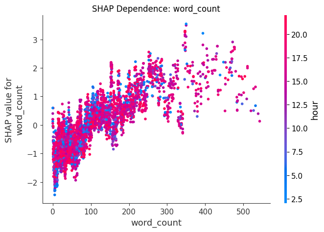
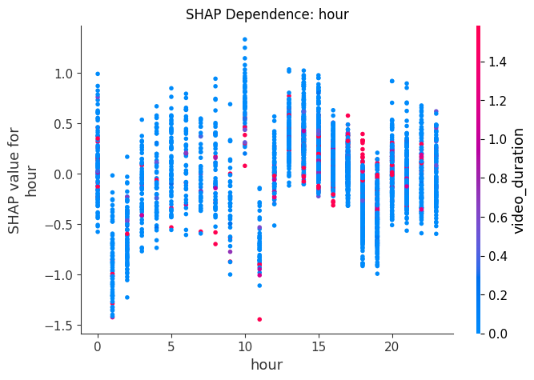

# LinkedIn Engagement Analysis: From Raw Data to Viral Strategy

**Project Status:** Completed
**Author:** Basil Dunford
**Tools:** Python, LightGBM, SHAP, Pandas, Scikit-learn

---

## 1. Executive Summary
This project analyzes **3,734 LinkedIn posts** to uncover what actually drives high engagement on the platform today. Using a full machine learning pipeline built on LightGBM, I reverse-engineered the behavioral signals that distinguish top-performing posts (Top 20%) from the rest.

**Key Insight:** LinkedIn’s engagement dynamics have shifted. My model (ROC AUC: 0.67) shows that **conversational depth**—measured by comments—is **5× more** predictive of virality than **broad reach** (Shares) or **passive approval** (Likes).

### Top-Level Findings
* **Content Length Wins:** Having a higher `word_count` is the #1 predictor of engagement.
* **"We" > "Me":** Posts using "Collective" language ("We", "Us") outperform self-promotion ("I", "Me") by **16%**.
* **Video is King:** `video_duration` is a top-3 feature; video content significantly outperforms text-only updates.
* **Timing is Critical:** Post performance is heavily dependent on `hour` and `weekday`.

---

## 2. Hypothesis & Research
Before modeling, I researched industry trends regarding the 2024/2025 LinkedIn algorithm updates to inform my feature engineering strategy.

* **Research:** Recent reports suggest LinkedIn is prioritizing "constructive conversations" and "knowledge sharing" over empty passive approval.(More in `docs/research.md`)
* **Hypothesis:** Based on this, I hypothesized that a scoring system weighted towards **Comments** would better reflect true high performance than one weighted towards Shares/Likes.
* **Validation:** This was confirmed. My custom "Scheme B" scoring metric (prioritizing comments) showed the highest correlation (**0.48**) with the top 20% of high-performing posts, outperforming the standard vanity metrics.

---

## 3. The "Magic Formula" for Virality
I engineered three distinct engagement scoring schemes to test which behavior best predicts success. Likes are vanity metrics, while comments are the true currency of engagement. 

| Scheme | Formula | Correlation (w/ Top 20%) | Verdict |
| :--- | :--- | :--- | :--- |
| **Scheme A (Reach)** | `Likes + 3*Comments + 5*Shares` | 0.44 | Good, but overvalues vanity metrics. |
| **Scheme B (Conversation)** | `Likes + 5*Comments + 3*Shares` | **0.48** | **WINNER:** Best predictor of success. |
| **Scheme C (Follower Ratio)** | `Engagements / Followers` | N/A | Discarded (insufficient follower data). |

**The Takeaway:** Optimizing for *conversation* (Scheme B) yields better results than optimizing for *reach* (Scheme A).

---

## 4. Actionable Playbook (10 Recommendations)
Based on SHAP value analysis and correlation studies, here is the data-backed playbook for maximizing engagement:

1.  **Prioritize Conversation:** Ask questions -> Drive engagement. Comments are weighted **5x** in my winning formula.
2.  **The "Goldilocks" Length:** Avoid having to short of a post or too long. Data shows that a post with word counts between **250 and 550 words** is just right.
3.  **Use "We" Language:** Shift from "I/Me" to "We/Us" to build community. Correlation with success: **+0.16**.
4.  **Leverage Video:** `video_duration` is a top predictor. Even short clips drive higher engagement than static images.
5.  **Post on Weekdays:** Avoid weekends. The `weekday` feature shows a sharp drop-off in engagement on Sat/Sun.
6.  **Timing Matters:** Posting between the small window of 10am and 11am yields the highest lift, with a second lower peak between 1-3pm. (Check `hour` plots in `data/visualizations`).
7.  **Use Emojis Strategically:** `has_emoji` is a top 5 feature. Use them to break up density, but don't spam.
8.  **Hit Trending Topics:** Top keywords found: **"AI"**, **"Founders"**, **"Future"**.
9.  **Immediacy:** Words like **"Today"**, **"Now"** and **"New"** correlate with higher engagement.
10. **Video Length Matters Too:**  Videos between 1.5 and 3 minutes are most engaging.

---

## 5. Visualizing Success
*Visual insights derived from the model.*

### A. What Drives Engagement? (Global Importance)

*The SHAP summary reveals that content depth (`word_count`) and timing (`hour`, `weekday`) are the strongest predictors of success.*

### B. Feature Deep Dives

<table>
  <tr>
    <td width="50%" style="text-align:center">
      <b>Optimal Length (`word_count`)</b>
    </td>
    <td width="50%" style="text-align:center">
      <b>Best Time (`hour`)</b>
    </td>
  </tr>
  <tr>
    <td>
      
    </td>
    <td>
      
    </td>
  </tr>
  <tr>
    <td style="text-align:center">
      <i>Engagement peaks between 250-550 words.</i>
    </td>
    <td style="text-align:center">
      <i>Posting at 10am yields the highest lift.</i>
    </td>
  </tr>
</table>

---

## 6. Technical Implementation

### Data Pipeline & Traceability
The project follows a modular ETL pipeline structure.
1.  **Ingestion**: `src/ingest_data.py` -> Loads raw JSON, verifies structure.
2.  **Cleaning**: `src/data_cleaning.py` -> Handles nulls, parses dates. output: `clean_data.csv`.
3.  **Feature Engineering**: `src/scoring_functions.py` -> Calculates Schemes A/B. output: `model_ready.csv`.
4.  **Modeling**: `src/models.py` -> Trains LightGBM, calculates SHAP values.
5.  **NLP**: `src/feature_engineering.py` -> TF-IDF and keyword extraction.

### Data Dictionary
I analyzed 3,734 posts. Key features include:

| Feature | Type | Description |
| :--- | :--- | :--- |
| `word_count` | Int | Total words in post body. |
| `video_duration` | Float | Length of video (0 if no video). |
| `hour` | Int | Hour of publication (0-23). |
| `weekday` | Int | Day of week (0=Mon, 6=Sun). |
| `has_emoji` | Bool | Presence of emojis in text. |
| `has_hashtag` | Bool | Presence of hashtags in text. |
| `engagement_score` | Float | The target variable (Scheme B). |

### Data Limitations & Mitigations
* **Missing Impressions:** `impressions` data was unavailable. **Mitigation:** Used raw engagement counts as the proxy for performance.
* **Missing Reaction:** `reaction` data was unavailable. **Mitigation:** Used `num_likes` as sole reaction type.   
* **Missing Followers:** Follower count missing for >99% of users. **Mitigation:** Pivoted from "Engagement Rate" to "Top 20% Classification" to ensure statistical validity.

---
## 7. Setup & Usage
**Prerequisites:** Python 3.8+

### Project Structure
- `data/`: Contains raw, intermediate, and feature data.
    - `raw/`: Raw JSON input.
    - `intermediate/`: Cleaned CSVs.
    - `features/`: Model-ready data and NLP outputs.
    - `models/`: Trained LightGBM model.
    - `visualizations/`: SHAP plots and binning charts.
- `src/`: Source code.
    - `pre_clean_data.py`: Converts raw JSON to CSV.
    - `ingest_data.py`: Loads and verifies raw data.
    - `data_cleaning.py`: Cleans data and extracts features.
    - `scoring_functions.py`: Calculates engagement scores (Schemes A, B, C).
    - `models.py`: Trains predictive model and computes SHAP values.
    - `feature_engineering.py`: Performs NLP analysis (TF-IDF, linguistic patterns).
    - `visualize_analysis.py`: Generates SHAP dependence plots and binning analysis.
- `docs/`: Documentation and reports.
    - `final_report.md`: Detailed findings and recommendations.
    - `project_log.md`: Log of data assumptions and issues.
    - `research.md`: Research notes.

### Setup
1. Install dependencies:
   ```bash
   pip install -r requirements.txt
   ```
2. Place your raw JSON data in `data/raw/`.

### Usage
Run the pipeline in order:

1. **Ingest Data**:
   ```bash
   python src/pre_clean_data.py
   python src/ingest_data.py
   ```
2. **Clean Data**:
   ```bash
   python src/data_cleaning.py
   ```
3. **Calculate Scores**:
   ```bash
   python src/scoring_functions.py
   ```
4. **Train Model**:
   ```bash
   python src/models.py
   ```
5. **Run NLP Analysis**:
   ```bash
   python src/feature_engineering.py
   ```
6. **Generate Visualizations**:
   ```bash
   python src/visualize_analysis.py
   ```